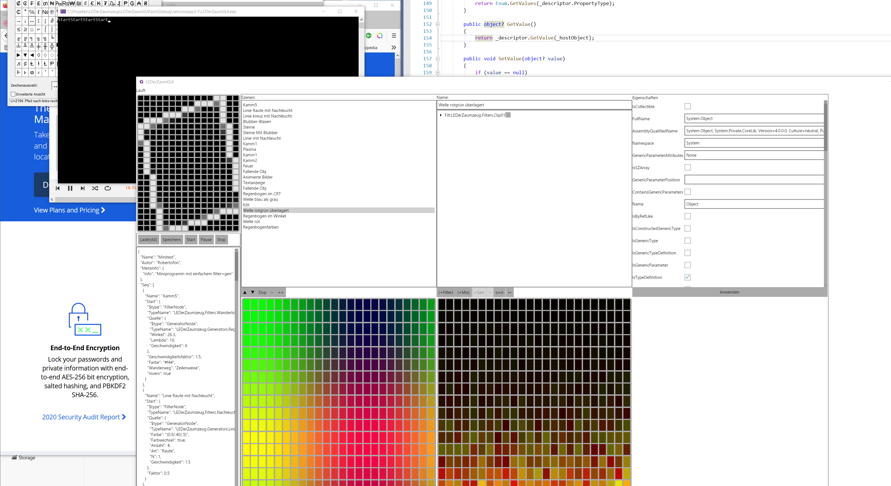

# LEDerZaumzeug

LED Bild Generator WS2801 WS2812b etc.

A LED image generator for WS2801 WS2812b etc. your custom matrix.

# Was
Geschrieben in C# für .Net core (auf allen Plattformen)
Mit Konfigurationsdateien, später mit GUI.
Animationssequenzen schreiben in JSON. Filter, Generatoren, Operatoren
Ein Generator schöner Grafikanimationen für LED-Matrixen.
Plug-In-Architektur
verschiedene Outputs etc.

siehe auch (mehr Beschreibung): [TPM2-pixelpanel](https://github.com/Robertofon/pixelpanel-TPM2.Net-SPI)

## CUI
Es gibt eine Kommandozeilenversion. Die kann Animationsprogramme abspielen (Player)
* LEDerzaumZeug

## GUI
Es gibt einen GUI-Editor für Programme und zum Laufenlassen (Player)
* LEDerzaumGUI

## LED-Anzeige
Es gibt ein Externes Programm als Display (Empfänger).
Das externe Programm kann auf einem PC gestartet werden und per Netzwerk an die Player angebunden weden
* AvaLEDerWand

# What

Code written in C# for .Net core to run on any platform.
Write your animation in JSON configuration files: Use Filters, generators and operators.
and have additional configuration for static data like address of you matrix.
Plug-In-Architekture
Later GUI support is added.
Current output only: TPM2

See also: [TPM2-pixelpanel](https://github.com/Robertofon/pixelpanel-TPM2.Net-SPI)

## CUI
There is a command line program to play out animations to receivers (TPM2 etc.)
* LEDerzaumZeug

## GUI
There is a GUI-Editor to create and modify Programs and to play out to receivers (Player)
* LEDerzaumGUI

## LED-Anzeige
There is an external soft display program (receiver)
The single program can be run on a pc and receive animations via network
* AvaLEDerWand

# Wie

So kann es aussehen. Anzahl der LED  XxY kann angepasst werden:

(c) Robert Köpferl 2021
